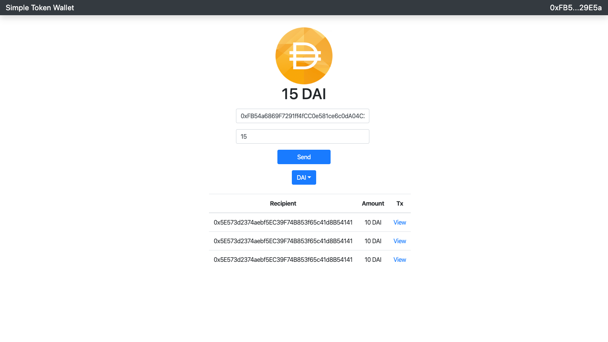

# Token Wallet
A simple interface that allows users to transfer tokens after selecting which ERC 20 token they would like to send. Forked from a Dapp University Project and added additional features including multi token support, more components, updates UI when the account is changed, and subscription to events to update the UI when a users sends a tx rather than having to refresh the page. 

